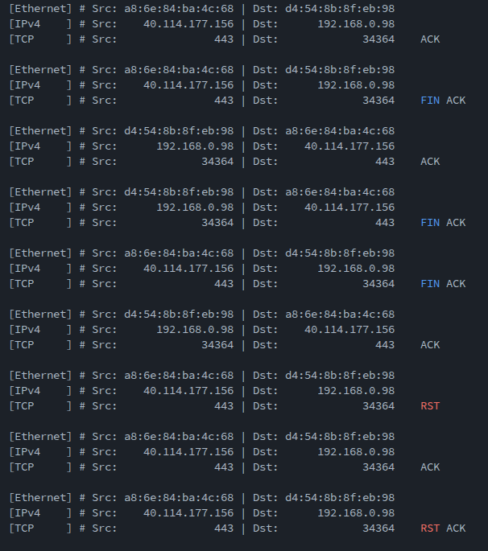

# 📡 Packet Sniffer (C / libpcap)

A lightweight packet sniffer written in C using **libpcap**.
Parses and formats network packets across multiple layers (Ethernet, IPv4, ARP, TCP, UDP).

---

## 🚀 Features

* 📡 Modular packet parsing (Layer 2–4)
* 🔧 Command-line interface (`-i`, `-c`, `-t`, `-l`)
* 🧠 Custom error & logging system (with colored output)
* 🔍 Interactive network interface selection
* 🧾 Clean, structured packet output

---

## 🖥️ Example Output



---

## ▶️ Usage

```bash
./ps -i eth0 -c 10 -t 1000 -l
```

### Options

* `-i <interface>`: Network interface
* `-c <count>`: Number of packets to capture
* `-t <timeout>`: Timeout in milliseconds
* `-l`: Enable extended logging

---

## 🔧 Build

```bash
make
```

Requires:

* `libpcap` (e.g. install via `sudo apt install libpcap-dev`)

---

## 🧪 Example Workflow

```bash
make
./ps -l
```

Then select an interface from the interactive menu.

---

## 🚧 Status

This project is a **work in progress**.

Planned features:

* 🔎 Packet filtering system
* 🌐 Extended protocol support
* 📤 Optional JSON output
* 📊 Improved packet inspection (flags, payload view)

---

## 🧠 Motivation

This project was built to deepen understanding of:

* Low-level networking
* Packet structures across OSI layers
* System programming in C
* Memory-safe parsing of binary data

---

## 📦 Project Structure (simplified)

```text
.
├── main.c
├── include/
├── src/
├── assets/
│   └── output.png
├── Makefile
└── README.md
```

---

## ⚠️ Notes

* Currently supports Ethernet (DLT_EN10MB) only
* Requires appropriate permissions to capture packets (may need `sudo`)
